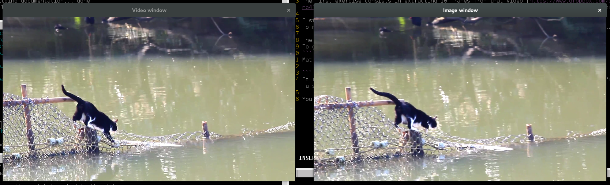

# Extraction of frames from a video

The first exercise consists in extracting 10 frames from that video [https://www.dropbox.com/s/h5wk1rhrqkgec6y/cat.mp4?dl=0](https://www.dropbox.com/s/h5wk1rhrqkgec6y/cat.mp4?dl=0), ideally with one frame every second.

I started by gettting and reading the video file. It is done with the class `VideoCapture`.
To make the computing easier, I reduced the resolution of the video to 800x450 with the `resizeWindow` function.

The variable used to store is 10 images is  : ` vector<Mat> images`.
To get only one image per second while still reading the video I made a simple function :
```
Mat nextImage(VideoCapture& capture, int frames, int fps, double mspf,
		string videoWindow, string imageWindow, int width, int height);
```
It reads the video and get the last image (here the "fps" one since we have to wait for fps frames to get the image a second later);

You can see here a screen capture of the result :

