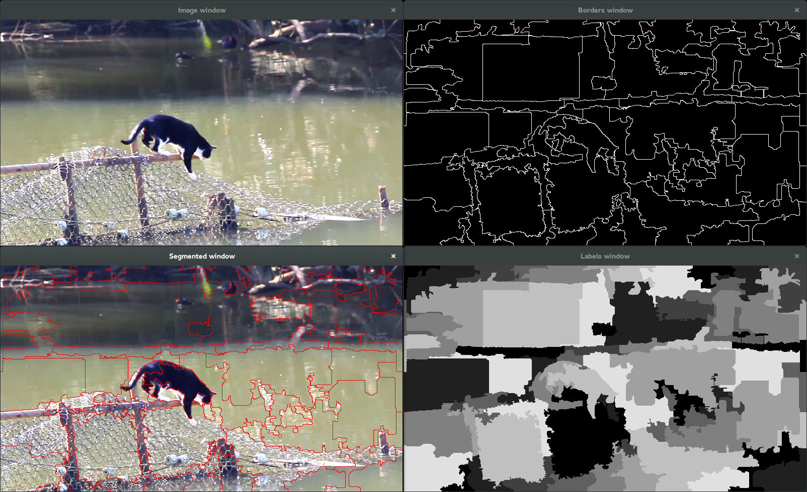

# SEEDS Superpixels algorithm

I will use the SEEDS superpixels algorithm ([http://docs.opencv.org/trunk/modules/ximgproc/doc/superpixels.html](http://docs.opencv.org/trunk/modules/ximgproc/doc/superpixels.html)) to segment the cat from the background.

You can find a lot more information on the algorithm here :
[http://www.mvdblive.org/seeds/](http://www.mvdblive.org/seeds/)

## Pre-segmentation using SEEDS

By using SEEDS superpixels the simplest way on the images,
we obtain segmentation like that :



It is quite difficult then to identify the superpixels corresponding or not to the cat.
Furthermore we can notice that sometimes superpixels does not correspond well to the cat.

Reading the paper ["*SEEDS: Superpixels Extracted via Energy-Driven Sampling*"](http://arxiv.org/pdf/1309.3848v1.pdf),
we learn that SEEDS algorithm is based on histograms to performs Pixel-level and Block-level movements
from an initial grid superpixels configuration.
Thus we theoretically have access to histograms of each superpixel,
wich may help us segment the cat.
But in practice, the interface given with OpenCV is reduced to that :
```
class CV_EXPORTS_W SuperpixelSEEDS : public Algorithm
{
    /** @brief Calculates the superpixel segmentation on a given image stored in SuperpixelSEEDS object.*/
    CV_WRAP virtual int getNumberOfSuperpixels() = 0;

    /** @brief Calculates the superpixel segmentation on a given image with the initialized parameters in the SuperpixelSEEDS object.*/
    CV_WRAP virtual void iterate(InputArray img, int num_iterations=4) = 0;

    /** @brief Returns the segmentation labeling of the image.*/
    CV_WRAP virtual void getLabels(OutputArray labels_out) = 0;

    /** @brief Returns the mask of the superpixel segmentation stored in SuperpixelSEEDS object.*/
    CV_WRAP virtual void getLabelContourMask(OutputArray image, bool thick_line = false) = 0;
};

/** @brief Initializes a SuperpixelSEEDS object.*/
CV_EXPORTS_W Ptr<SuperpixelSEEDS> createSuperpixelSEEDS(
        int image_width, int image_height, int image_channels,
        int num_superpixels, int num_levels, int prior = 2,
        int histogram_bins=5, bool double_step = false);
```

We have two ways to deal with it :

1. Keep that segmentation and then work with the labels map
(reevaluate manually the parameters that interest us)
2. Use the original SEEDS algorithm (C++) available [here](http://www.mvdblive.org/seeds/)
and make it work with OpenCV (so we could use its full potential)

Since I do not have the time make a complete interface between
the original SEEDS algorithm and OpenCV, I will try the first option,
even if I am aware that it will bring down the performances.


## Segmentation of the cat
